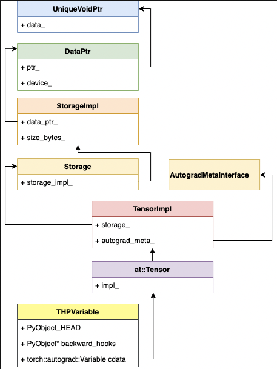

# Tensor

## init

What's behind `import torch` ?

```python
# torch/__init__.py

from torch._C import *
```

```c
// torch/csrc/stub.c

PyMODINIT_FUNC PyInit__C(void)
{
  return initModule();
}
```

```cpp
// torch/csrc/Module.cpp

extern "C"
TORCH_API PyObject* initModule();
PyObject* initModule() {
  THPUtils_addPyMethodDefs(methods, TorchMethods);
  THPUtils_addPyMethodDefs(methods, torch::autograd::python_functions());

  static struct PyModuleDef torchmodule = {
     PyModuleDef_HEAD_INIT,
     "torch._C",
     nullptr,
     -1,
     methods.data()
  };
  ASSERT_TRUE(module = PyModule_Create(&torchmodule));
  ASSERT_TRUE(THPGenerator_init(module));
  ASSERT_TRUE(THPException_init(module));
  THPSize_init(module);
  THPDtype_init(module);
  THPDTypeInfo_init(module);
  THPLayout_init(module);
  THPMemoryFormat_init(module);
  THPQScheme_init(module);
  THPDevice_init(module);
  THPStream_init(module);
  ASSERT_TRUE(THPVariable_initModule(module));
  ASSERT_TRUE(THPFunction_initModule(module));
  ASSERT_TRUE(THPEngine_initModule(module));

  at::init();

  return module;
}
```

Why `torch` have method `tensor` ?

Since method `tensor` is in  `methods.data()`.

But How ?


## class torch.Tensor 

What's behind `torch.Tensor` ?

### From py to cpp

```python
# torch/__init__.py

from ._tensor import Tensor
```

python `Tensor` 都继承自 `torch._C._TensorBase`

```python
# torch/_tensor.py

class Tensor(torch._C._TensorBase):
    def __deepcopy__(self, memo):
        ...
    def storage(self):
        return self._typed_storage()
    def backward(self, gradient=None, retain_graph=None, create_graph=False, inputs=None):
        torch.autograd.backward(
            self, gradient, retain_graph, create_graph, inputs=inputs
        )
    def register_hook(self, hook):
        return handle
    ...
```

python 的 `torch._C._TensorBase` 绑定在 cpp `THPVariableType` 上

```cpp
// torch/csrc/autograd/python_variable.cpp

bool THPVariable_initModule(PyObject *module)
{
  THPVariableMetaType.tp_base = &PyType_Type;
  if (PyType_Ready(&THPVariableMetaType) < 0)
    return false;
  Py_INCREF(&THPVariableMetaType);
  PyModule_AddObject(module, "_TensorMeta",   (PyObject *)&THPVariableMetaType);

  static std::vector<PyMethodDef> methods;
  THPUtils_addPyMethodDefs(methods, torch::autograd::variable_methods);
  THPUtils_addPyMethodDefs(methods, extra_methods);
  THPVariableType.tp_methods = methods.data();
  if (PyType_Ready(&THPVariableType) < 0)
    return false;
  Py_INCREF(&THPVariableType);
  PyModule_AddObject(module, "_TensorBase",   (PyObject *)&THPVariableType);
  torch::autograd::initTorchFunctions(module);
  torch::autograd::initTensorImplConversion(module);
  return true;
}

PyTypeObject THPVariableType = {
    PyVarObject_HEAD_INIT(
        &THPVariableMetaType,
        0) "torch._C._TensorBase", /* tp_name */
    sizeof(THPVariable), /* tp_basicsize */
    0, /* tp_itemsize */
    ...
    THPVariable_pynew, /* tp_new */
};

PyTypeObject THPVariableMetaType = {
  PyVarObject_HEAD_INIT(DEFERRED_ADDRESS(&PyType_Type), 0)
  "torch._C._TensorMeta",                      /* tp_name */
  sizeof(THPVariableMeta),
  ...
  THPVariableMetaType_init,                    /* tp_init */
  nullptr,                                     /* tp_alloc */
  nullptr,                                     /* tp_new */
};
```


```cpp
// torch/csrc/autograd/python_variable.h

// Python object that backs torch.autograd.Variable
struct THPVariable {
  PyObject_HEAD;
  // Payload
  c10::MaybeOwned<at::Tensor> cdata;
  // Hooks to be run on backwards pass (corresponds to Python attr
  // '_backwards_hooks', set by 'register_hook')
  PyObject* backward_hooks = nullptr;
};
```

```cpp
// torch/csrc/autograd/function_hook.h

namespace torch { namespace autograd {

using Variable = at::Tensor;
using variable_list = std::vector<Variable>;

} }
```

### TensorBase and Tensor

TensorBase

`Tensor` 继承自 `TensorBase`, `TensorBase` 不依赖 function 自动生成，使用 `TensorBase` 可以避免自动生成部分有改动时全量编译，其次是引用计数问题。

```cpp
// aten/src/ATen/core/TensorBase.h

// Convert Tensor to TensorBase without any need to include Tensor.h
TORCH_API const TensorBase& get_tensor_base(const Tensor& t);

// NOTE: [Tensor vs. TensorBase]
//
// Tensor, being the central data structure in PyTorch, gets used and
// it's header included almost everywhere. Unfortunately this means
// every time an operator signature is updated or changed in
// native_functions.yaml, you (and every other PyTorch developer) need
// to recompile all of ATen and it's dependencies.
//
// TensorBase aims to break up these header dependencies, and improve
// incremental build times for all PyTorch developers. TensorBase
// represents a reference counted handle to TensorImpl, exactly the
// same as Tensor. However, TensorBase doesn't have code generated
// methods in it's API and thus no dependence on native_functions.yaml.
//
// Usage tips
// ----------
// - You can `#define TORCH_ASSERT_NO_OPERATORS` at the top of a .cpp
//   or .cu file to ensure it has no header dependencies on
//   native_functions.yaml (direct or indirect).
// - Tensor inherits from TensorBase, so functions taking
//   `const TensorBase &` are callable with Tensor as well.
// - TensorBase can be converted to tensor with `Tensor(tensor_base)`,
//   but this requires a reference-count bump. OptionalTensorRef on
//   the other hand can materialize a `const Tensor &` without
//   touching the reference-count.
class TORCH_API TensorBase {
 public:
  const c10::intrusive_ptr<TensorImpl, UndefinedTensorImpl>& getIntrusivePtr() const {
    return impl_;
  }

  c10::intrusive_ptr<TensorImpl, UndefinedTensorImpl> unsafeReleaseIntrusivePtr() {
    return std::move(impl_);
  }

  DispatchKeySet key_set() const {
    return impl_->key_set();
  }
  ScalarType scalar_type() const {
    return typeMetaToScalarType(impl_->dtype());
  }
  const Storage& storage() const {
    return impl_->storage();
  }

  Layout layout() const noexcept {
    return impl_->layout();
  }

  caffe2::TypeMeta dtype() const noexcept {
    return impl_->dtype();
  }

  inline Device device() const {
    return impl_->device();
  }

  int64_t get_device() const {
    // NB: this is not a native function to avoid dispatching overhead.
    return impl_->get_device();
  }

  TensorOptions options() const {
    return TensorOptions().dtype(dtype())
                          .device(device())
                          .layout(layout());
  }

  void* data_ptr() const {
    return this->unsafeGetTensorImpl()->data();
  }

  template <typename T>
  T * data_ptr() const;

  at::TensorBase tensor_data() const;

  at::TensorBase variable_data() const;

  const std::shared_ptr<torch::autograd::Node>& grad_fn() const;

protected:
  c10::intrusive_ptr<TensorImpl, UndefinedTensorImpl> impl_;
};
```

Tensor API

```cpp
// torch/include/ATen/core/TensorBody.h
// aten/src/ATen/templates/TensorBody.h

// Tensor is a "generic" object holding a pointer to the underlying TensorImpl object, which$ has an embedded reference count. 
// similar to boost::intrusive_ptr.
class TORCH_API Tensor: public TensorBase {
 protected:
  friend MaybeOwnedTraits<Tensor>;
  friend OptionalTensorRef;

 public:
  explicit Tensor(
      c10::intrusive_ptr<TensorImpl, UndefinedTensorImpl> tensor_impl)
      : TensorBase(std::move(tensor_impl)) {}
  Tensor(const Tensor &tensor) = default;
  Tensor(Tensor &&tensor) = default;

  explicit Tensor(const TensorBase &base): TensorBase(base) {}
  c10::MaybeOwned<Tensor> expect_contiguous(MemoryFormat memory_format=MemoryFormat::Contiguous) const &;
  c10::MaybeOwned<Tensor> expect_contiguous(MemoryFormat memory_format=MemoryFormat::Contiguous) && = delete;

  Tensor& operator=(const TensorBase& x) & {
    impl_ = x.getIntrusivePtr();
    return *this;
  }
  Tensor& operator=(TensorBase&& x) & { }
  Tensor& operator=(const Tensor &x) & { }
  Tensor& operator=(Tensor &&x) & { }
  Tensor& operator=(Scalar v) && { }
  Tensor& operator=(const Tensor &rhs) && { }
  Tensor& operator=(Tensor&& rhs) && { }

  void backward(const Tensor & gradient={}, c10::optional<bool> retain_graph=c10::nullopt, bool create_graph=false, c10::optional<TensorList> inputs=c10::nullopt) const { }
  Tensor data() const {
    return TensorBase::data();
  }
}
```

Tensor 的继承关系



`at:Tensor` 本质是 Tensor 的 API，底层是 `TensorImpl`

```cpp
// c10/core/TensorImpl.h

/**
 * The low-level representation of a tensor, which contains a pointer
 * to a storage (which contains the actual data) and metadata (e.g., sizes and
 * strides) describing this particular view of the data as a tensor.
 *
 */

struct C10_API TensorImpl : public c10::intrusive_ptr_target {
  enum ImplType { VIEW };

 public:

  virtual IntArrayRef strides() const;

  TENSORIMPL_MAYBE_VIRTUAL const Storage& storage() const {
    return storage_;
  }

  Device device() const {
    return *device_opt_;
  }

  Layout layout() const {
    // This keyset must also be kept in sync with the logic in
    // is_sparse() / is_sparse_csr() / is_mkldnn()
    constexpr auto sparse_and_sparsecsr_and_mkldnn_ks =
        c10::sparse_ks | c10::sparse_csr_ks | c10::mkldnn_ks;
    ...
  }

  Storage storage_;

  inline T* data() const {
      return data_ptr_impl<T>();
  }
  inline T* data_ptr_impl() const {
      return storage_.unsafe_data<T>() + storage_offset_;
  }

  inline void* data() const {
      return static_cast<void*>(
        static_cast<char*>(storage_.data()) +
        data_type_.itemsize() * storage_offset_);
  }

  const caffe2::TypeMeta dtype() const {
    return data_type_;
  }

  DeviceType device_type() const {
    return (*device_opt_).type();
  }

 private:
  // This pointer points to an AutogradMeta struct that stores autograd-specific
  // fields (such as grad_ / grad_fn_ / grad_accumulator_). This pointer always
  // has unique ownership (meaning only one TensorImpl can own it at a time).
  //
  std::unique_ptr<c10::AutogradMetaInterface> autograd_meta_ = nullptr;

 protected:
  std::unique_ptr<c10::NamedTensorMetaInterface> named_tensor_meta_ = nullptr;

  c10::VariableVersion version_counter_;

  PyObject* pyobj_;

  c10::impl::SizesAndStrides sizes_and_strides_;

  caffe2::TypeMeta data_type_;

  c10::optional<c10::Device> device_opt_;

  const at::Tensor& grad() const;
}
```

Storage

```cpp
// c10/core/Storage.h

struct C10_API Storage {

  void* data() const {
    return storage_impl_.get()->data();
  }

  at::DataPtr& data_ptr() {
    return storage_impl_->data_ptr();
  }

  const at::DataPtr& data_ptr() const {
    return storage_impl_->data_ptr();
  }

 protected:
  c10::intrusive_ptr<StorageImpl> storage_impl_;
};
```

StorageImpl

```cpp
// c10/core/StorageImpl.h 

struct C10_API StorageImpl : public c10::intrusive_ptr_target {
 private:
  DataPtr data_ptr_;
  size_t size_bytes_;
  bool resizable_;
  bool received_cuda_;
  Allocator* allocator_;
```

UniqueVoidPtr 

```cpp
// c10/util/UniqueVoidPtr.h

namespace c10 {

using DeleterFnPtr = void (*)(void*);

namespace detail {

class UniqueVoidPtr {
 private:
  void* data_;
  std::unique_ptr<void, DeleterFnPtr> ctx_;
}

} }
```

`detail::UniqueVoidPtr` is an owning smart pointer like `unique_ptr`

* specialized to void 
* specialized for a function pointer deleter `void(void* ctx)`
* deleter is guaranteed to be called when the unique pointer is destructed and the context is non-null

PyTorch Tensor 相关主要数据结构和关系


## function torch.tensor

```python
torch.tensor(1.0)
```

pytorch 使用 [PyMethodDef](https://docs.python.org/3/c-api/structures.html#c.PyMethodDef)
暴露 python tensor, 对应类型 THPVariable_tensor.

```cpp
// torch/csrc/autograd/python_torch_functions_manual.cpp

static PyMethodDef torch_functions_manual[] = {
    {"tensor",
     castPyCFunctionWithKeywords(THPVariable_tensor),
     METH_VARARGS | METH_KEYWORDS | METH_STATIC,
     nullptr},
}

// implemented on python object to allow torch.tensor to be constructed with
// arbitrarily nested python objects - list, tuple, np array, scalar, etc.
static PyObject* THPVariable_tensor( PyObject* self, PyObject* args, PyObject* kwargs) {
  jit::tracer::warn("torch.tensor", jit::tracer::WARN_CONSTRUCTOR);
  return THPVariable_Wrap(torch::utils::tensor_ctor(
      torch::tensors::get_default_dispatch_key(),
      torch::tensors::get_default_scalar_type(),
      r));
}
```

* torch::utils::tensor_ctor() 返回 cpp tensor
* torch::tensors::get_default_dispatch_key() 获取默认 dispatch key
* torch::tensors::get_default_scalar_type() 获取默认数据类型
* THPVariable_Wrap 把 tensor 封装成 python 可使用的 THPVariable


### tensor_new

```cpp
// torch/csrc/utils/tensor_new.cpp

Tensor tensor_ctor(
    c10::DispatchKey dispatch_key,
    at::ScalarType scalar_type,
    PythonArgs& r) {
  if (r.idx == 0) {
    PyObject* data = r.pyobject(0);
    bool type_inference = r.isNone(1);
    bool pin_memory = r.toBool(3);
    bool args_requires_grad = r.toBool(4);
    auto new_tensor = internal_new_from_data(
        typeIdWithDefault(r, 2, dispatch_key),
        r.scalartypeWithDefault(1, scalar_type),
        r.deviceOptional(2),
        data,
        /*copy_variables=*/true,
        /*copy_numpy=*/true,
        /*type_inference=*/type_inference,
        pin_memory);
    auto names = r.toDimnameListOptional(5);
    if (names) {
      at::namedinference::propagate_names(
          new_tensor, *names, /*validate_names=*/true);
    }
    new_tensor.detach_(); // ensure new_tensor a leaf node
    new_tensor.set_requires_grad(args_requires_grad);
    return new_tensor;
  }
}
```

* 解析参数
* 调用 internal_new_from_data 创建 cpp tensor，初始化 storage_
* new_tensor.detach_() 确保是叶子结点，初始化 autograd_meta_

### internal_new_from_data

```cpp
// torch/csrc/utils/tensor_new.cpp

Tensor internal_new_from_data(
    c10::TensorOptions options,
    at::ScalarType scalar_type,
    c10::optional<Device> device_opt,
    PyObject* data,
    bool copy_variables,
    bool copy_numpy,
    bool type_inference,
    bool pin_memory = false) {
  if (THPVariable_Check(data)) {
    auto var = THPVariable_Unpack(data);
    return var.to(...);
  }

  if (PyObject_HasAttrString(data, "__cuda_array_interface__")) {
    auto tensor = tensor_from_cuda_array_interface(data);
    return tensor.to(...);
  }

  if (is_numpy_available() && PyArray_Check(data)) {
     auto tensor = tensor_from_numpy(data, /*warn_if_not_writeable=*/!copy_numpy);
     return tensor.to(...);
  }

  auto device = device_opt.has_value() ? *device_opt : options.device();
  auto sizes = compute_sizes(data, scalar_type);
  ScalarType inferred_scalar_type = type_inference ? infer_scalar_type(data) : scalar_type;

  Tensor tensor;
  {
    {
      if (isStorage(data)) {
        Storage storage = createStorageGetType(data, storage_scalar_type, is_typed_storage);
        tensor = at::empty( sizes,
            at::initialTensorOptions().dtype( is_typed_storage ? storage_scalar_type : inferred_scalar_type)
                .pinned_memory(pin_memory)
                .device(storage.device()));
        tensor.set_(storage);

      } else {
        TensorOptions opts = at::initialTensorOptions().dtype(inferred_scalar_type);
        tensor = at::empty(sizes, opts.pinned_memory(pin_memory));
        recursive_store(
              (char*)tensor.data_ptr(),
              tensor.sizes(),
              tensor.strides(),
              0,
              inferred_scalar_type,
              tensor.dtype().itemsize(),
              data);
      }
    }
    maybe_initialize_cuda(device);
    tensor = tensor.to(device, inferred_scalar_type, /*non_blocking=*/false, /*copy=*/false);
  }

  return at::lift_fresh(tensor);
}
```

* at::empty() 创建 tensor
* recursive_store() 初始化 tensor 数据

其中 `detach_` 调用会调用 materialize_autograd_meta 初始化 autograd_meta_.

```cpp
// torch/csrc/autograd/variable.cpp

AutogradMeta* materialize_autograd_meta(const at::TensorBase& self) {
  auto p = self.unsafeGetTensorImpl();
  if (!p->autograd_meta()) {
    p->set_autograd_meta(std::make_unique<AutogradMeta>());
  }
  return get_autograd_meta(self);
}
```


### PyMethodDef

[PyMethodDef](https://docs.python.org/3/extending/extending.html) including

* PyModuleDef
* PyInit_\* and PyModule_Create

```cpp
// torch/csrc/autograd/python_variable.cpp

bool THPVariable_initModule(PyObject* module) {
  PyModule_AddObject(module, "_TensorMeta", (PyObject*)&THPVariableMetaType);

  static std::vector<PyMethodDef> methods;
  THPUtils_addPyMethodDefs(methods, torch::autograd::variable_methods);
  THPUtils_addPyMethodDefs(methods, extra_methods);
  THPVariableType.tp_methods = methods.data();
  PyModule_AddObject(module, "_TensorBase", (PyObject*)&THPVariableType);
  torch::autograd::initTorchFunctions(module);
  torch::autograd::initTensorImplConversion(module);
  return true;
}
```

initTorchFunctions

```cpp
// torch/csrc/autograd/python_torch_functions_manual.cpp

namespace torch {
namespace autograd {

static PyTypeObject THPVariableFunctions = {
    PyVarObject_HEAD_INIT(
        nullptr,
        0) "torch._C._VariableFunctionsClass", /* tp_name */
    0, /* tp_basicsize */
    ...
}

void initTorchFunctions(PyObject* module) {
  static std::vector<PyMethodDef> torch_functions;
  gatherTorchFunctions(torch_functions);
  THPVariableFunctions.tp_methods = torch_functions.data();

  if (PyModule_AddObject(
          module,
          "_VariableFunctionsClass",
          reinterpret_cast<PyObject*>(&THPVariableFunctions)) < 0) { }
  THPVariableFunctionsModule =
      PyType_GenericNew(&THPVariableFunctions, Py_None, Py_None);
  if (PyModule_AddObject(
          module, "_VariableFunctions", THPVariableFunctionsModule) < 0) { }
}
} // namespace autograd
} // namespace torch
````

checkout it out

```python
torch._C._VariableFunctionsClass.__dict__['tensor']
<staticmethod object at 0x7f55f7b45ed0>
```

gatherTorchFunctions 填充 torch_functions, 包括 tensor.

```cpp
// torch/csrc/autograd/python_torch_functions_manual.cpp

void gatherTorchFunctions(std::vector<PyMethodDef>& torch_functions) {
  constexpr size_t num_functions =
      sizeof(torch_functions_manual) / sizeof(torch_functions_manual[0]);
  torch_functions.assign(
      torch_functions_manual, torch_functions_manual + num_functions);
  gatherTorchFunctions_0(torch_functions);
  gatherTorchFunctions_1(torch_functions);
  gatherTorchFunctions_2(torch_functions);

  static std::array<std::pair<const char*, const char*>, 4> aliases{
      {// Canonical function, alias name
       {"sspaddmm", "saddmm"},
       {"mm", "spmm"},
       {"mm", "dsmm"},
       {"hspmm", "hsmm"}}};

  for (const auto& alias : aliases) {
    auto it = std::find_if(
        torch_functions.begin(),
        torch_functions.end(),
        [&](const PyMethodDef& def) {
          return strcmp(def.ml_name, alias.first) == 0;
        });
    TORCH_INTERNAL_ASSERT(
        it != torch_functions.end(),
        "Failed to create function alias from ",
        alias.first,
        " to ",
        alias.second);
    PyMethodDef alias_def = *it;
    alias_def.ml_name = alias.second;

    torch_functions.push_back(alias_def);
  }

  torch_functions.push_back({nullptr});
}
```

`torch_functions.assign(torch_functions_manual, ...);`

> 很多 functions 由
`tools/autograd/gen_python_functions.py`
自动生成的文件
`torch/csrc/autograd/generated/python_torch_functions_0.cpp`
定义。文件中的这些 functions 由同文件中的函数
`gatherTorchFunctions_0` 添加到 `torch_functions` 从而添加进 `PyModuleDef`.

```python
# tools/autograd/gen_python_functions.py 

# These functions require manual Python bindings or are not exposed to Python
_SKIP_PYTHON_BINDINGS = [
    "tensor",
]

def gen( out: str, native_yaml_path: str, tags_yaml_path: str, deprecated_yaml_path: str, template_path: str, *, symint: bool = True,):
    create_python_bindings( None, "python_variable_methods.cpp",)
    create_python_bindings_sharded( "torch", "python_torch_functions.cpp",)
    create_python_bindings( "torch.nn", "python_nn_functions.cpp",)
    create_python_bindings( "torch.fft", "python_fft_functions.cpp",)
    create_python_bindings( "torch.linalg", "python_linalg_functions.cpp",)
    create_python_bindings( "torch.nested", "python_nested_functions.cpp",)
    create_python_bindings( "torch.sparse", "python_sparse_functions.cpp",)
    create_python_bindings( "torch.special", "python_special_functions.cpp",)
    create_python_return_type_bindings( fm, functions, lambda fn: True, "python_return_types.cpp")
```

## Tensor API dependency

The dependency of tensor related API


## View

Tensor view explication


